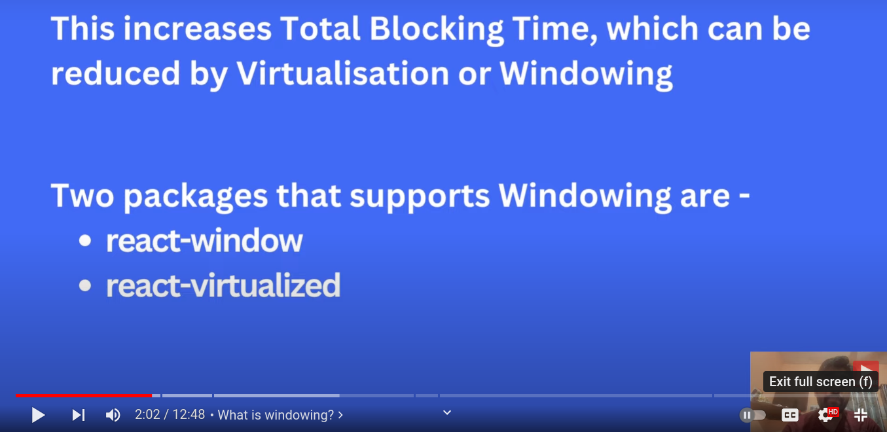
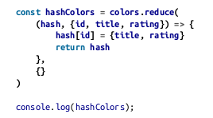
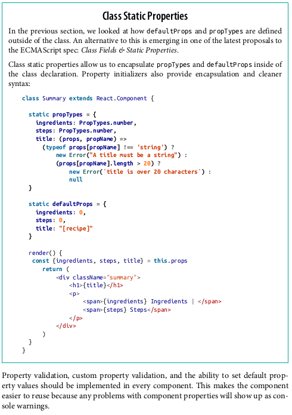
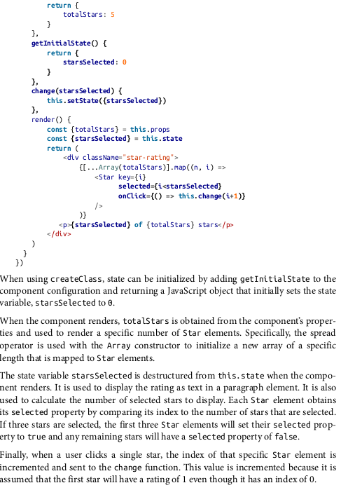

# react_interview_preparation

## Theorical Questions Section

### Theorical Question 1

Do you what is a const in react ?

<b>Answer</b>

<b>Source</b>

Alex Banks anf Eve Porcello learning React Pag 7

### Theorical Question 2

Do you know what the let special word is for in react ?

<b>Answer</b>

<b>Source</b>

Alex Banks anf Eve Porcello learning React Pag 7

### Theorical Question 3

Do you know what the arrow functions are?

<b>Answer</b>

<b>Source</b>

Alex Banks anf Eve Porcello learning React Pag 7

### Theorical Question 4

What does setTimeOut does in react ?

<b>Answer</b>

<b>Source</b>

Taken from google bard

### Theorical Question 5

What are windows in react ?

<b>Answer</b>

<b>Source</b>

https://www.youtube.com/watch?v=mi_IOknMh5s&t=221s

### Theorical Question 6

how can you find blocking elements in React ?

<b>Answer</b>

Using the google chrome extension lighthouse

<b>Source</b>

https://www.youtube.com/watch?v=mi_IOknMh5s&t=221s

### Theorical Question 7

Do you know what hooks are in React ?

<b>Answer</b>

 React recommend using functions over classes , the thing is that classes have several things that classes have not, like state, for example in the class below we are remembering a variable count

 

 To do something similar you need a hook, in order to store states in functions

 

 count and setCount can be called as you prefer

<b>Source</b>

https://www.twilio.com/blog/react-choose-functional-components

https://react.dev/reference/react

https://www.reddit.com/r/reactjs/comments/p9o49g/can_someone_explain_what_setloading_does_and_why/

### Theorical Question 8

Do you know what Destructuring Assignment is in React ?

<b>Answer</b>

 

 

<b>Source</b>

Alex Banks anf Eve Porcello learning React Pag 19

### Theorical Question 9

Do you know what Object Literal Enhancement is in React ?

<b>Answer</b>

 

 

<b>Source</b>

Alex Banks anf Eve Porcello learning React Pag 19

### Theorical Question 10

Do you know what the spread operator is in React ?

<b>Answer</b>

 

 

 

<b>Source</b>

Alex Banks anf Eve Porcello learning React Pag 19

### Theorical Question 11

Do you know what the promises are in React ?

<b>Answer</b>

 

<b>Source</b>

Alex Banks anf Eve Porcello learning React Pag 24

https://www.youtube.com/watch?v=tieV1n0NFPM&t=378s

### Theorical Question 12

Do you know what the modules are in React ?

<b>Answer</b>

 

  

<b>Source</b>

Alex Banks anf Eve Porcello learning React Pag 24

### Theorical Question 13

What It Means to Be Functional ?

<b>Answer</b>

 

 

 

 

 

 

 

  

   

  

 

 

<b>Source</b>

Alex Banks anf Eve Porcello learning React Pag 32

### Theorical Question 14

Do you  understand what compose does in  React ?

<b>Answer</b>

https://redux.js.org/api/compose 

<b>Source</b>

https://redux.js.org/api/compose

### Theorical Question 15

Do you  understand what then does in  React ?

<b>Answer</b>

https://developer.mozilla.org/en-US/docs/Web/JavaScript/Reference/Global_Objects/Promise/then

<b>Source</b>

https://developer.mozilla.org/en-US/docs/Web/JavaScript/Reference/Global_Objects/Promise/then

### Theorical Question 16

Do you  understand the difference between == and === in  React ?

<b>Answer</b>

https://codeahoy.com/javascript/2019/10/12/==-vs-===-in-javascript/#:~:text=The%20difference%20between%20%3D%3D%20and%20%3D%3D%3D%20is%20that%3A,the%20two%20variables%20being%20compared.

<b>Source</b>

https://codeahoy.com/javascript/2019/10/12/==-vs-===-in-javascript/#:~:text=The%20difference%20between%20%3D%3D%20and%20%3D%3D%3D%20is%20that%3A,the%20two%20variables%20being%20compared.

### Theorical Question 16

Do you  understand thewhat the React and ReactDOM does  React and why they were separated ?

<b>Answer</b>

React is the library for creating views. ReactDOM is the library used
to actually render the UI in the browser.

Views are all of the elements that the user can see in the UI.

React and ReactDOM were split into two packages for version 0.14. The release notes
state: “The beauty and the essence of React has nothing to do with browsers or the
DOM... This [splitting into two packages] paves the way to writing components that
can be shared between the web version of React and React Native.” 1 Instead of assum‐
ing that React will render only in the browser, future releases will aim to support rendering for a variety of platforms.

<b>Source</b>

Alex Banks anf Eve Porcello learning React Pag 59

### Theorical Question 17

Do you  know what jsx is ?

<b>Answer</b>

<b>Source</b>

Alex Banks anf Eve Porcello learning React Pag 84

### Theorical Question 18

Do you  know what babel is ?

<b>Answer</b>

Most software languages allow you to compile your source code. JavaScript is an
interpreted language: the browser interprets the code as text, so there is no need to
compile JavaScript. However, not all browsers support the latest ES6 and ES7 syntax,
and no browser supports JSX syntax. Since we want to use the latest features of Java‐
Script along with JSX, we are going to need a way to convert our fancy source code
into something that the browser can interpret. This process is called transpiling, and
it is what Babel is designed to do

<b>Source</b>

Alex Banks anf Eve Porcello learning React Pag 84

### Theorical Question 19

Do you  know what commonJS is ?

<b>Answer</b>

<b>Source</b>

Alex Banks anf Eve Porcello learning React Pag 28

### Theorical Question 20

Do you  know what webpack is ?

<b>Answer</b>

Once we start working in production with React, there are a lot of questions to con‐
sider: How do we want to deal with JSX and ES6+ transformation? How can we man‐
age our dependencies? How can we optimize our images and CSS?

Many different tools have emerged to answer these questions, including Browserify,
Gulp, and Grunt. Due to its features and widespread adoption by large companies,
webpack has also emerged as one of the leading tools for bundling CommonJS mod‐
ules.

Webpack is billed as a module bundler. A module bundler takes all of our different
files (JavaScript, LESS, CSS, JSX, ES6, and so on) and turns them into a single file.
The two main benefits of modular bundling are modularity and network performance.

<b>Source</b>

Alex Banks anf Eve Porcello learning React Pag 93

### Theorical Question 21

Do you  know what Property Validation / props is in React ?

<b>Answer</b>

<b>Source</b>

Alex Banks anf Eve Porcello learning React Pag 93

### Theorical Question 22

Do you  know what Reference / refs are in React ?

<b>Answer</b>

<b>Source</b>

Alex Banks anf Eve Porcello learning React Pag 119

### Theorical Question 23

How do we manage state in React ?

<b>Answer</b>

<b>Source</b>

Alex Banks anf Eve Porcello learning React Pag 123

### Theorical Question 24

Do you know what the single source of thruth means in React ?

<b>Answer</b>

<b>Source</b>

Alex Banks anf Eve Porcello learning React Pag 132

### Theorical Question 25

How would you turn a component into a presentational component?

<b>Answer</b>

<b>Source</b>

Alex Banks anf Eve Porcello learning React Pag 132

